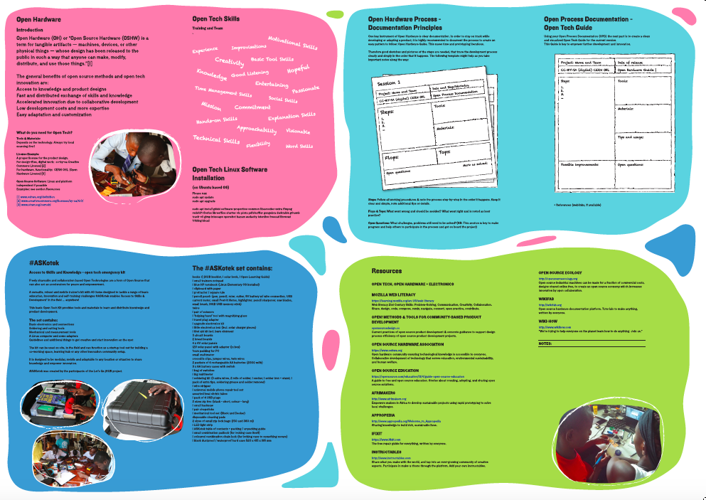
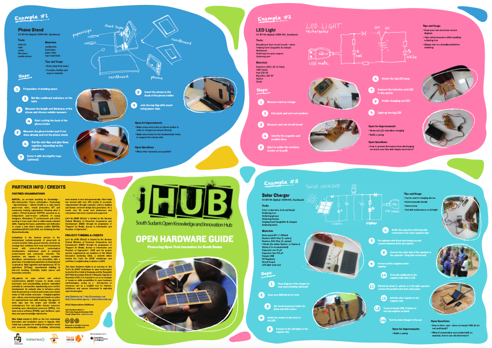

# #ASKnet Open-Hardware-Guide

This repository includes the material (texts / graphics / Source file / pdf) of the #ASKnet __Open Hardware Guide__ poster .

Open Hardware (OH) or “Open Source Hardware (OSHW) is a term for tangible artifacts — machines, devices, or other physical things — whose design has been released to the public in such a way that anyone can make, modify, distribute, and use those things.”

Following up on the 2016 “Let’s Go jHUB” programme, the OPEN HARDWARE GUIDE or #OHG is an outcome of the Open Tech and Repair Skills workshop led by Timm Wille and hosted by the Hive Colab innovation hub in Kampala.

As a follow-up to the first Open Learning Guide (#OLG) the Open Hardware Guide gives examples of hands-on skills possibilities and projects applying open hardware methodologies. Acting as an introduction to resources and as a tangible tool in the form of a rugged A1 poster for trainers, tinkerers and facilitators, the #OHG is ready for distribution to anyone interested in exploring open technologies in a very practical way.

The #OHG content was developed by the workshop participants based on their designs and documented steps in test workshops held with students at the Panyadoli Self-Help Secondary School in Bweyale, Uganda. Alongside the #OHG, the participants helped develop and test #ASKotek, the ‘Access to Skills and Knowledge – open tech emergency kit‘ a field-trainers resource tool-kit for repairing, building and learning about practical electronics including small scale solar power.

More about [#ASKnet](https://www.weareasknet.org/) here.

## Design Description

# **Color scheme + Hex Color Codes:**

###  front page:

*  Top left corner (pink): #F38BAF
*  Top right Corner (turqouise): #7CCFDD
*  Bottom left corner (blue): #519DD0
*  Bottom right corner (green) : #B5D44D

###  back page
    Same as back with addition of a yellow square:

*  Top left corner example #1 phone stand (blue): #519DD0
*  Top Right Corner example #2 LED light (pink): #F38BAF
*  Bottom right corner, example #3 Solar Charger (Turqouise): #7CCFDD
*  Bottom left corner with Jhub logo, title page (green): #B5D44D
*  Bottom left corner with partner info/credits (yellow): #F0C539

### graphics + font colors (black and white)

* text: titles in White, body in black
* graphics: outline sketches are white and the steps in each corner.

# **Fonts used:**

* **Title:**  Knockout HTF51 Middleweight   [Download Font](https://copyfonts.com/fonts/knockout-htf51-middleweight.html)
* **Body Text:**  Knockout HTF31-JuniorMiddlewt   [Download Font](https://copyfonts.com/download/knockout-htf31-juniormiddlewt.html)
* **words in white back page (in pink top left corner and the word example, the numbers, and Steps, the text in the templates):**  Chalkduster [Download Font](https://www.ffonts.net/Chalkduster.font)
* **Other (unsure where):** Myriad Pro Regular
  [Download Font](https://fontsgeek.com/fonts/Myriad-Pro-Regular)

# **Text:**

You can acess the raw text files from the text folder:

* [Front Text](text/OHG-front-FINAL-TEXT.md)
* [Back Text](text/OHG-back-FINAL-TEXT.md)

# **Images:**

You can acess the raw images files graphics, icons, and logos from the images folder [here](https://github.com/opencultureagency/Open-Documentation-Guide/tree/master/images)

* [Front images](https://github.com/opencultureagency/Open-Hardware-Guide/tree/master/images/front)
* [Back images](https://github.com/opencultureagency/Open-Hardware-Guide/tree/master/images/back)
* [Logos](https://github.com/opencultureagency/Open-Hardware-Guide/tree/master/images/logos)

# **Source File:**

Adobe Illustrator file:
* [Download Source File](https://cloud.openculture.agency/index.php/s/Dp577rPHnMobQ9m)
PDF Print-Ready file:
* [Download Print-Ready PDF File](https://cloud.openculture.agency/index.php/s/dy2ZZWA39mzPGiS)

# **Editorial Team:**
**Content Creator & Editor**

Design: Adam Ferns  
Assembled & Edited by: Jodi Rose  
Timm Wille [Github](https://github.com/timmwille/)

## Partners and Founders

| r0g Agency |      ASKnet      |  BMZ |
|----------|:-------------:|------:|
| | |  |
| [Official Website](https://openculture.agency/) | [Official Website](https://github.com/ASKnet-Open-Training) | [Official Website](https://www.bmz.de/en/) |

## License
[CC-BY-SA 4.0](LICENSE.md) 2017

The Let’s Go jHUB (#LGJ) project, in collaboration with icebauhaus e.V. (Weimar), KAPITAL / jHUB (Juba) and r0g_agency for open culture gGmbH (Berlin), was funded by the German Federal Ministry of Economic Cooperation and Development (BMZ) through its programme of “Support for Media, Access to Information and Freedom of Expression”. Given the violence that broke out in Juba, South Sudan’s capital, in the summer of 2016, the programme was implemented though the generous support and cooperation of GIG partner organisations iceaddis in Addis Ababa, mLAB and iHUB in Nairobi, kLAB in Kigali and Hive Colab in Kampala.

Open Hardware Guide is free and open for use, modification and sharing by anyone!

Corrections and suggestions for amendments are also very welcome!
